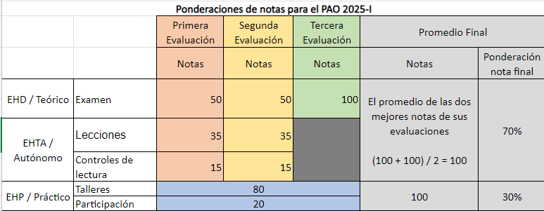

# Fundamentos de Programación
# 2025 PAO II 

### Prof. Carlos Cedeño

Este documento presenta las indicaciones generales y las políticas del curso, así como las ponderaciones de calificación y otros aspectos relevantes del curso.

---

# Información personal

- Ingeniero en Telemática
- Máster en Data Science
- Docente e investigador @ ESPOL / CTI
- CTO @ Forward Consulting
- AWS Academy Educator
- ~ 6 años de experiencia como Senior Dev
- SmartX Journal Club Founder
- ccedeno.com

---

# Información de contacto

-   caencede@espol.edu.ec <- Medio de contacto formal
-   MS Teams              <- Medio de contacto informal
-   Oficina 11F 115, previa planificación
-   Preferible no escribir por AV

---

# Sobre calificaciones

---

---

# Políticas Generales

Presentarse regular y puntualmente a las clases. Asistir con 5 minutos de anticipación especialmente cuando haya actividades evaluadas. No se otorgará tiempo adicional si el estudiante llega tarde sin una debida justificación.

No se permite el uso de celulares durante la clase. Favor colocar sus teléfonos en modo “silencio” y tener en cuenta las alarmas. 

---

La asistencia a clases será controlada para efectos de reprobación de la asignatura. Esto incluye las demás obligaciones del estudiante, es decir, debe rendir las evaluaciones, exámenes, talleres, lecciones en las fechas y horas establecidas.

Según el Reglamento de Grado de ESPOL, el estudiante reprueba la materia si tiene 40% de faltas.

---

La clase empezará 10 minutos después de la hora oficial (Ej. 07h10) cuando se procederá a tomar la asistencia. En caso de llegar tarde **esperar a finalizar la clase** e indicar al profesor para registrar el atraso.

3 atrasos = 1 falta

Las fechas de lecciones, talleres y exámenes estan publicadas desde el día 1 de clase y empezarán puntual según la hora indicada. Tomar las precauciones del caso dado que no habrá extensiones del tiempo. (Ej. verificar el aula del exámen con anterioridad)

---

# Sobre el uso de LLMs

A partir de este semestre se regulará el uso de asistentes de programación con restricciones. Las indicaciones específicas se darán en las siguientes clases.

---

## Cualquier uso indebido de herramientas de programación, no seguir las indicaciones en las actividades que si lo permiten, y el plagio en deberes, talleres, lecciones y exámenes será penalizado con la anulación del trabajo y sujeto a reporte frente al consejo de disciplina.

---

# Recursos

- http://programacion.espol.edu.ec/ Página con recursos de la materia.
- http://blog.espol.edu.ec/ccpg1001/ Ejercicios, exámenes resueltos.
- https://www.mclibre.org/consultar/python/  Ejercicios sobre python3 de universidad de Valencia-España. 
- https://www.youtube.com/channel/UCvSOZzsdziyVVPmfA7Sah5A  Clases de Python3 de profesor de ESPOL (Rafael Bonilla).
- https://www.youtube.com/playlist?list=PLagErt3C7iltgifmiGFQFI1GhUAKQvvyb  Curso de Python3 de Código Facilito.
